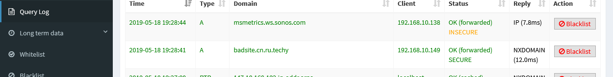

# Pi-hole with DD-WRT

Protecting and monitoring your home network can be a chore. However
several modern devices take some of the pain out of the equation, if you
are willing to spend money, and at the same time add more vendors to the
list of ones who can track all your home internet activity. Your ISP
(Verizon, Comcast, AT&T etc.) monitors all your traffic through the same
system they use to provide your Internet access. It’s very difficult to
prevent them from knowing: every site you visit, when, for how long, and
from what device. You might subscribe to a VPN, but unless you built the
VPN, then the VPN service has all the information you used to provide to
your ISP. In that case you have simply shifted vendors, and probably
slowed down all your internet access.

So, take it as a given that some vendors know most if not all of your
Internet activity. If you stay logged in to Google, or Microsoft, or
Firefox, add them to the list. The point here is that adding one more
vendor to the list (and all their business partners) may not be a major
concern. The vendors generally don’t really want to harm you, but
instead use the information to sell you things, or sell *you* as a
target to others who want to sell you things.

I say all this because the guide I’m about to write is mostly for fun,
my own education, and does not make any serious attempt to reduce or
eliminate the list of vendors that can track your Internet activity. In
fact in some cases I may suggest commercial products that increase the
number of vendors on your list of activity trackers.

To that end, if you want to accomplish similar to what I am about to
describe, with minimal personal involvement while adding to your
tracking vendor list, maybe look into Firewalla Blue
(<https://firewalla.com/products/firewalla-blue>) which is a pretty neat
device that can monitor your Internet activity, act as a firewall, block
advertisements, and a lot more. It’s the device that prompted me to see
if I could achieve similar without adding to my personal list of vendors
that track me.

## What is the aim?

The aim is to enable me to monitor all Internet traffic requests
originating from my WiFi network, and selectively block traffic I don’t
personally like. The Firewalla device will do this, for about $100-$200
in a really nice and easy to install package. It has more features,
including a phone app, but sends a lot of tracking data to its own
servers.

In their documentation they mention that Firewalla is similar to Pi-hole
for many of their features. Pi-hole is free, and open source, and can be
installed on a Raspberry Pi, which costs less than $50.

## What did I build?

Since I already had a Raspberry Pi sitting dormant, I decided to see if
I could get Pi-hole running on it and monitoring my traffic. The DD-WRT
comes into play only because I already had it running, and there is an
obscure setting required to get it and the Pi-hole working together. If
you don’t have DD-WRT, I’ll explain in concept the change you will need
to make to achieve similar on your network.

## Step-by-step

1.  Build your Raspberry Pi

2.  Install Pi-hole

3.  Configure Pi-hole to do minimal blocking

4.  Configure DD-WRT to point clients to Pi-hole for DNS

There are some fairly nice high level guides here that will walk through
most of steps 1 and 2.  
<https://opensource.com/article/18/2/block-ads-raspberry-pi>  
<https://www.smarthomebeginner.com/pi-hole-tutorial-whole-home-ad-blocking/>  

I’ll point out a few things that you need to adjust or consider. First,
maybe go wireless and headless on the Raspberry Pi by installing xRDP.
With this setup you can hide the Pi device anywhere convenient and still
access using your favorite RDP client from Windows, MacOS, Linux, iPad
etc. To install xRDP type

`sudo apt-get install xrdp`

That’s it. Done. You can now remote into the Pi over the net. In my
case, I had never accessed the Pi remotely, so I had to set the password
for the default “pi” user.

`sudo passwd pi`

Type the password twice. I don’t know if the password expires. If so
I’ll have to connect via console later to reset. You could use “chage”
to make the password last forever if you want but I won’t cover that
here.

Now connect to the Pi over RDP to make sure it works. Then move the Pi
to whatever location you like. All the better if in the process the
device turns off and reboots, which will verify you have a resilient
configuration.

Via RDP connection, update the OS just in case

`sudo apt-get update && apt-get upgrade`  
`sudo reboot`

Connect again via RDP and install Pi-hole. The typical curl piped
through bash as shown on the Pi-hole website may not work, so if it
doesn’t download the install script, and run it.

`curl -sSL https://install.pi-hole.net | bash`

If that bombs, just download as mentioned

`wget -O basic-install.sh https://install.pi-hole.net`  
`sudo bash basic-install.sh`

When asked about the network interface, choose wireless, probably wlan0
and when asked about the IP, leave it as whatever exists. Later we will
reserve that IP in the DD-WRT so the Pi always gets it. When you are
asked what DNS server Pi-hole should query, pick your poison. For me
Cloudflare is good. You can also choose to use DNSSEC with Cloudflare.
When you get to the part about default block lists, un-star all but
https://s3.amazonaws.com/lists.disconnect.me/simple\_tracking.txt

Which is listed as DisconTrack in the UI. This is because we mostly want
Pi-hole as a monitoring tool. Keep the rest if you want, but you’ll
probably just make your family angry by blocking too much. There is an
easy way to add more via the Web UI later if you choose to.

Finish the install, and note the password required for Pi-hole web site
access. Then upgrade again and reboot again just for fun.

`sudo apt-get update && apt-get upgrade`  
`sudo reboot`

Now Pi-hole is running and would
intercept bad DNS requests, but none of your devices are using it. The
guides linked above say to go to your router and set it to push Pi-hole
as the DNS host for all clients. While that’s the end goal, maybe take a
baby step first. Configure just ONE of your hosts to use Pi-hole for
DNS. Doing so is beyond this guide, but just Google “static DNS” and
“windows” or whatever your OS is.

With that one host configured to use Pi-hole for DNS, visit some
websites that exist, and some that don’t like
<https://badsite.cn.ru.techy> then login to the `pi.hole/admin` on your local network
and look at the traffic using the Query log menu item. You should see
something like this

At this time your web browser will show a simple “server not found” for
that bad address which is as you would expect since the address is
something we made up. Pi-hole forwarded the request on to Cloudflare who
said, *nope doesn’t exist*, which Pi-hole relayed back to your client.

Note the “Blacklist” button on the right of each domain. You can use
that to block any site you don’t want visited. By default, a blacklisted
site will look (to the requesting client) just the same as the made up
site we tried to visit. However, you can edit the config to make it tell
the user it was intentionally blocked if you like.

If configured to alert the user, they will see something like the image
above.

To enable that setting, follow the guide here
<https://docs.pi-hole.net/ftldns/blockingmode/#pi-holes-ip-ipv6-nodata-blocking>
which is a little confusing. Basically edit
`/etc/Pi-hole/Pi-hole-FTL.conf` and add `BLOCKINGMODE=IP-NODATA-AAAA`

That same page shows several other modes you may want instead. Try them
out until you find the right one for your situation. Other settings may
be better if your main goal is to prevent IoT devices from phoning home
with all your metadata.

Once you are confident things are set as desired, login to your router
and have it tell clients to use Pi-hole for DNS. This is different on
every router. The links near the start of this guide show one way, and
I’ll detail how to set it on DD-WRT.

In DD-WRT, make sure you have enabled the use of dnsmasq, and in the
Services\>services\>Additional DNSMasq Options:

`dhcp-option=6,192.168.1.250`

Change 192.168.1.250 to the IP of your Pi-hole device. Save and Apply.
Wait for the router to reboot. Log back into DD-WRT and set the MAC
address of your Pi-hole to attain a static IP following this guide  
<https://wiki.dd-wrt.com/wiki/index.php/Static_DHCP>

Now it’s all set up\! You can monitor all traffic on your WiFi network,
and block anything you don’t like.
